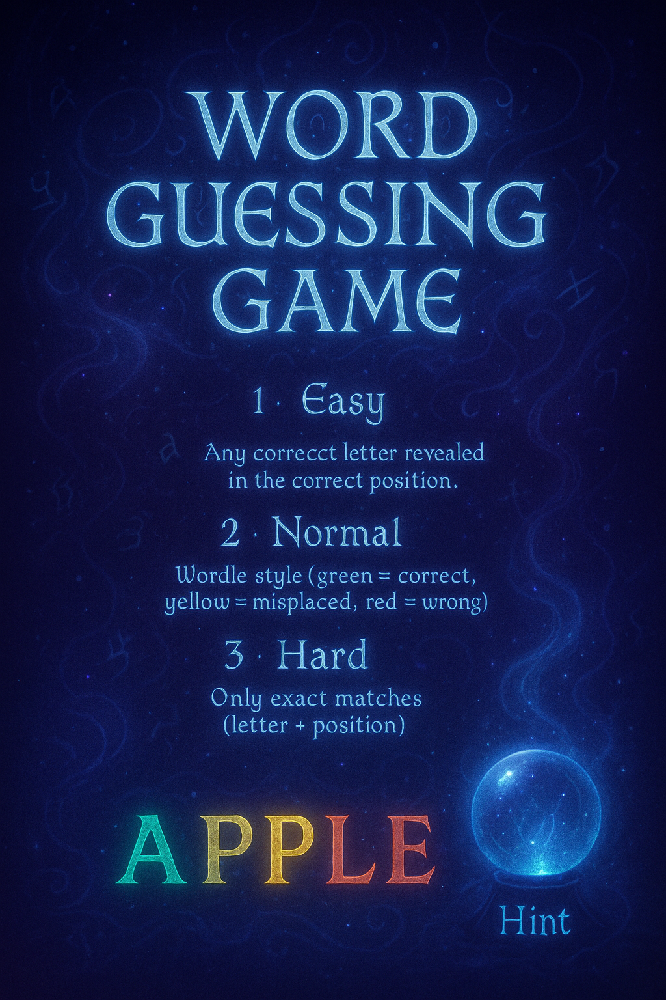

# COMP9001_Final_Project
Final project code in Comp9001

# File Overview
- <mark>game.py</mark>: Core gameplay mechanics and entry point of the application. 
- <mark>words_generator.py</mark>: Read the required words from the file and save them in words.txt 
- <mark>gsl-101-by-band-qq9o.xls</mark>：An open source English dictionary, you can access it from [this link](https://www.newgeneralservicelist.org/)
- <mark>words.txt</mark>: thesaurus

# How to Run
First, you need to run words_generator.py to read words from gsl-101-by-band-qq9o.xls using the following command
<pre> python words_generator.py </pre>

Or you can choose to skip this step and just use the words.txt I provided, the effect is the same!

Next, you need to run game.py to start this program
<pre> python game.py </pre>
